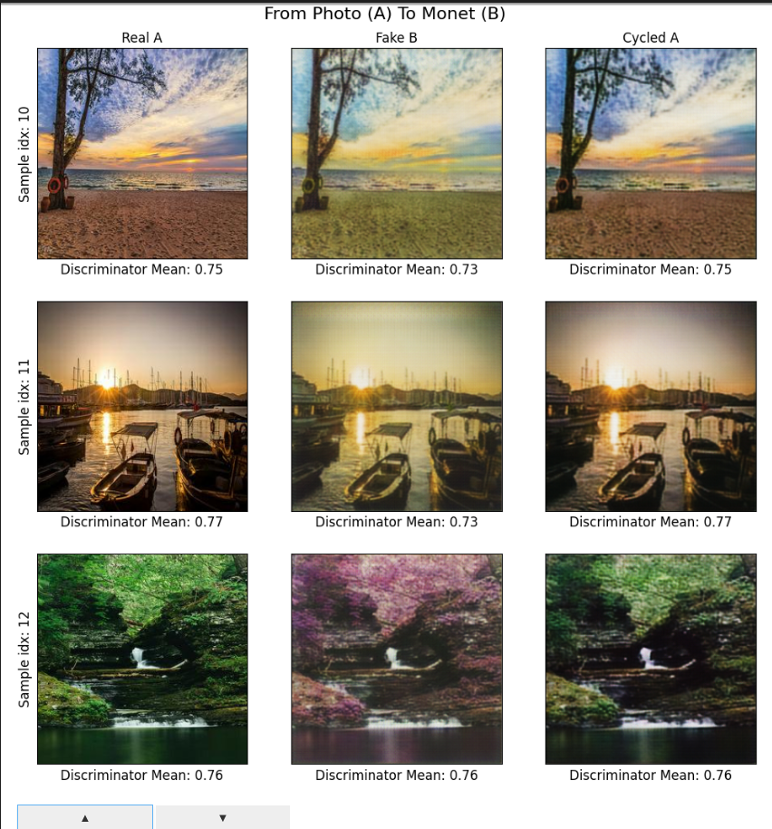
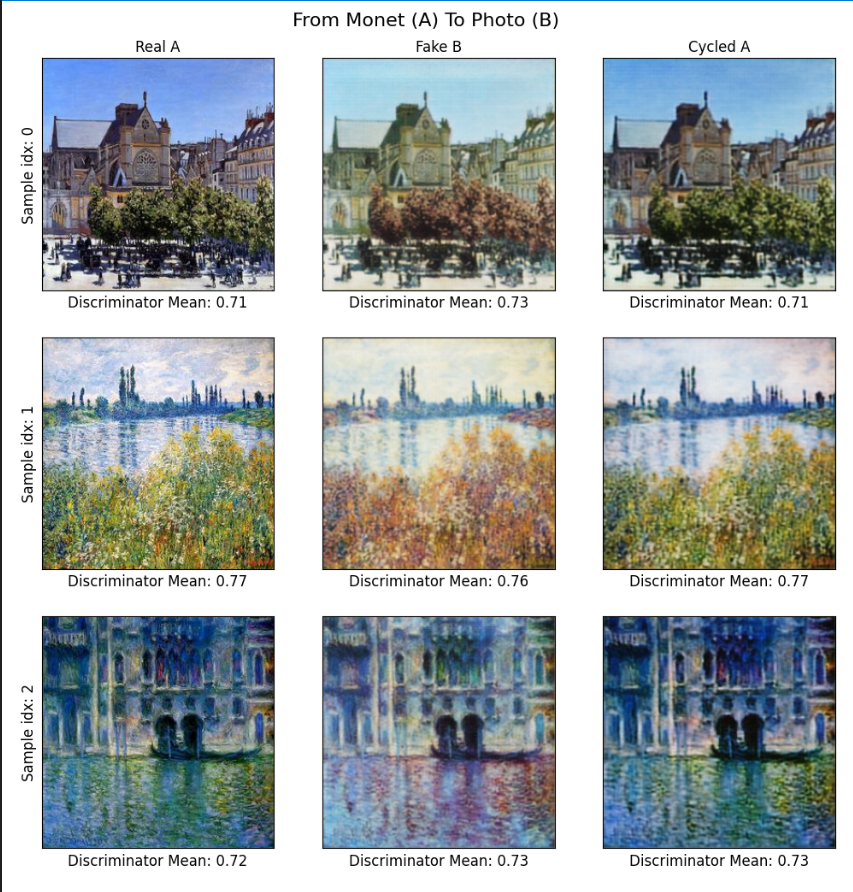

## Results
### Baseline Experiment
Some results from initial experiment. The model was trained with default settings of `lr=2e-4` and `epochs=15`. I tried number of different runs with more epochs, various lrs as well as different order of loss and backward computation to ensure that everything is in the right oder. All seems good and with this baseline I get a score of about 79.99 on Kaggle which is pretty poor. 

**Photo -> Monet**
The fake photos with monet style at least look similar to real ones with some visible changes to the style. It's not yet a proper Monet but Discriminator already has issues recognising it as a fake, same for the cycled images which look pretty good. 

**Monet -> Photo**
The fake monet with photo style is pretty similar to the other output, i.e. some style but not really photo style, Discriminator is leaning more towards real on fakes as well. One thing that I've noticed with some trained models is weird artifacts in fake outputs of Generators, for instance, a grid like (small) artifact appearing in the corner of images, exactly in the same spots, random patterns. Seems like Generators must've learned to fool Discriminators with that particular set of artifacts/features. This is not so apparent with the output of that baseline model but I can still see grid like structure applied to the fake outputs.
